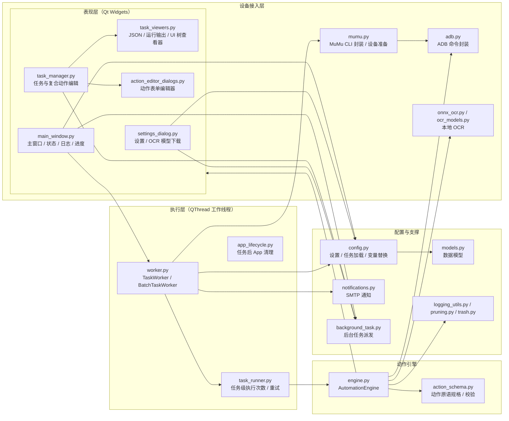
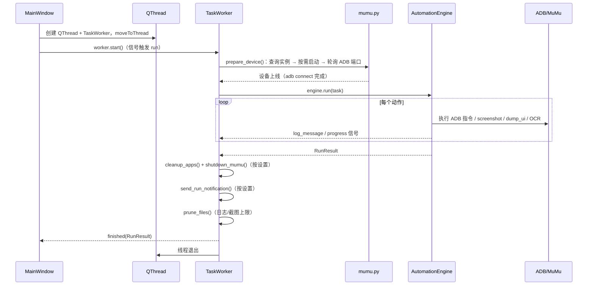

# FREE 架构说明

FREE 是一个 **Windows 桌面端的安卓自动化工具**：通过 MuMu Player 12（`mumu-cli`）与 ADB 控制模拟器内已登录的 App，按用户在「任务管理」中自定义的流程自动执行签到、领奖、分享等操作。本文件描述项目的整体分层、核心数据流与关键设计约定，面向需要维护或扩展该项目的开发者。

## 1. 总体架构

FREE 采用清晰的分层结构：**GUI 表现层 → 后台执行层 → 动作引擎 → 设备接入层**，配置与数据文件全部落在项目根目录的 `config/` 下，运行产物（日志、截图、OCR 模型）为运行时生成。



**设计要点**

- **引擎与应用框架解耦**：`AutomationEngine` 只依赖 ADB 客户端、截图目录与回调函数（日志 / 进度 / OCR），不依赖任何 Qt Widgets（唯一例外的 `QImage` 仅用于校验截图尺寸）。因此引擎可以被纯 `unittest` 直接测试。
- **配置驱动**：任务、复合动作、执行次数、清理策略、通知等全部由 `config/` 下的 JSON 文件驱动，无需改代码即可编排新流程。
- **线程模型**：所有耗时工作（设备准备、动作执行、OCR、模型下载）都放在 `QThread` 中，通过 Qt 信号回传日志 / 进度 / 结果；主线程只做 UI 刷新。

## 2. 技术栈

| 组件 | 用途 |
| --- | --- |
| Python ≥ 3.11.4 | 运行时 |
| PySide6 ≥ 6.7 | 桌面 GUI（Qt Widgets + QSS） |
| MuMu Player 12 `mumu-cli.exe` | 模拟器实例的启动 / 关闭 / 查询（JSON 输出） |
| adb.exe | 设备连接、输入注入、截图、UI 层级 dump |
| onnxocr-ppocrv5 + onnxruntime + opencv-python + numpy | 本地 OCR（PP-OCRv5/v6 det/rec 模型） |
| `unittest` + `unittest.mock` | 自动化测试（无需 pytest 插件） |

运行环境固定为模拟器 **1080×1920、480 dpi**（见 `free_app/constants.py`），引擎会在连接后校验实际屏幕规格，不一致则任务失败。

## 3. 目录结构

```text
FREE/
├─ main.py                        # 根目录启动入口（仅调用 free_app.main:main）
├─ pyproject.toml                 # 打包、依赖、mypy 配置
├─ config/                        # 用户配置（全部为 JSON）
│  ├─ settings.json               #   全局设置（由 settings.example.json 模板生成）
│  ├─ settings.example.json       #   设置模板（首次运行自动复制）
│  ├─ tasks/*.json                #   任务定义（文件名必须等于任务 id）
│  └─ actions/*.json              #   复合动作库定义
├─ free_app/                      # 核心包（见第 4 节各层）
├─ tests/                         # 单元测试，与 free_app 模块一一对应
├─ logs/                          # 运行日志（运行时生成）
├─ models/                        # OCR 模型（设置页下载，运行时生成）
├─ screenshots/                   # 动作/失败/关键页截图（运行时生成）
└─ ARCHITECTURE.md / README.md
```

## 4. 分层详解

### 4.1 表现层（GUI）

| 模块 | 职责 |
| --- | --- |
| `main.py` | 入口：解析项目根目录（`default_base_directory()`），创建 `QApplication` 与主窗口，设置中文字体 |
| `main_window.py` | `MainWindow`：三层页面的容器。主页含任务列表（支持拖拽排序）、设备状态、运行日志面板、单任务/全部任务执行与停止按钮；还负责把 `TaskWorker` / `BatchTaskWorker` 移到 `QThread`、把运行日志按级别写入 `logs/run_<时间戳>.log` |
| `settings_dialog.py` | `SettingsDialog`：MuMu/ADB 路径、执行与清理、重试、OCR 模型选择与下载管理（`ModelDownloadWorker`）、SMTP 邮件的分页设置；`_FieldBinding` 一张表驱动控件的读取/写入/收集，保存经 `config.update_settings()` 单点读-改-写 |
| `task_manager.py` | `TaskManagerWidget`：任务与复合动作的可视化编辑（内嵌 `ActionEditorWidget` / `ActionListEditorWidget`）、JSON 预览、单步骤试运行与 Toast 提示。两个名称列表页由 `_EntryListPanel` 规格对象驱动共享实现，内嵌编辑器导航状态收敛在 `_EmbeddedNavigator` |
| `task_viewers.py` | 任务管理页的嵌入查看器：`JsonViewerWidget`（JSON 预览）、`RunViewerWidget`（单动作试运行输出）、`UiTreeDumpWidget`（UI 层级抓取/搜索/点击插入）及其后台抓取 worker |
| `action_editor_dialogs.py` | 由 `action_schema.ParamSpec` 驱动的表单生成器：`ActionEditorDialog` / `ActionEditorWidget` / `ActionListEditorDialog` / `CompoundEditorDialog`，负责把参数规格渲染成中文表单并回读校验结果 |
| `message_box.py` | 统一中文按钮文案与样式的 `QMessageBox` 子类 |
| `styles.py` | 共享 QSS 片段（控件、下拉框、按钮、滚动条、消息框配色、嵌入式面板底座与内容区），所有页面复用 |

### 4.2 执行层（工作线程）

| 模块 | 职责 |
| --- | --- |
| `worker.py` | `TaskWorker`（单任务）与 `BatchTaskWorker`（顺序批量），共同继承 `_WorkerBase`（共享停止事件、设置字段与 `_finish_with()` 收尾：通知 → 清理旧输出 → 必发 `finished`）。公共流程：`prepare_device()` → 执行任务 → `cleanup_apps()` → `shutdown_mumu()`/`shutdown_mumu_app()` → 发送邮件通知 → 清理旧输出文件。批量模式下每个任务之间做一次 App 清理，失败可重试（见 6.5）|
| `task_runner.py` | 任务级执行控制：`task_execution_count()` 读取 `task_execution_counts[task_id]`；`run_task_executions()` 允许一个任务在同一批次内尝试最多 N 次，成功后即停，重试前按需执行 App 清理与 ADB 重连回调 |
| `app_lifecycle.py` | 任务结束后的进程清理：按 `cleanup_packages` 列表对每个包执行 `adb force-stop`，延迟与开关均来自设置 |

### 4.3 动作引擎

`engine.py` 的 `AutomationEngine` 是系统的核心。`run(task)` 依次执行任务的每个动作，包一层任务级 try/except 产出 `RunResult`：

- 每个动作先 `describe_action()` 生成日志描述，再走 `_run_with_retries()`（动作级重试，见 6.5）；
- 动作处理器通过 `_ACTION_HANDLERS` 表把动作类型直接映射到 `_execute_*` 方法引用（无反射），加载时校验「原语类型集合 == 处理器集合」；
- **信任边界**：动作参数在加载/保存/试运行时已由 `validate_action_params()` 校验，`_execute()` 统一套用 `effective_parameters()` 后把已解析参数交给处理器——默认值的唯一来源是 `action_schema` 的 `ParamSpec`，引擎内不做类型宽容或第二套默认值；
- `detect` / `click` 支持 **OCR 文本、UI 文本、UI resource-id、坐标** 四种定位方式，共享同一超时轮询骨架（`_poll_until()`：`timeout_seconds` / `interval_seconds`，异常去重记录后重试）；
- `detect` 把结果写入引擎的上下文 `_context`（`result_var`、`*_found`、`*_coord`、`*_count`），`if` / `loop_until` 读取该上下文做分支与循环；
- 停止语义：`request_stop()` 置 `threading.Event`，引擎在每次动作前后、轮询循环内、`_sleep()` 分片（≤0.2s）中检查，命中则抛 `StopRequested`；
- 每步动作前后的前台包名日志（"动作前台/动作完成前台"）需额外执行 2-4 次 ADB 子进程调用，由 `log_foreground_package` 设置控制，默认关闭；
- 截图：`capture_screenshot` 动作保存「关键页截图」（会作为邮件附件）；失败时保存失败截图；保存数由 `max_screenshot_files` 控制（0 = 不保存，负数 = 不限制，正数 = 保留最新 N 个）。

### 4.4 设备接入层

| 模块 | 职责 |
| --- | --- |
| `mumu.py` | `MuMuController` 封装 `mumu-cli.exe` 的 info/control 命令（启动、查询、关闭）。`prepare_device()` 是核心流程：读取实例状态 → 按需自动启动 → 轮询等待动态 ADB 转发端口出现 → `adb connect` 并确认设备上线；`shutdown_mumu()` 会轮询实例状态直到进程真正停止；另有 `connect_to_mumu()` / `connect_to_running_mumu()`（调试模式直连已运行实例）。`adb_candidates()` / `cli_candidates()` / `resolve_adb_path()` 是安装目录内程序路径推导的唯一来源（默认安装位置兜底见 `constants.DEFAULT_MUMU_DIRECTORY`）|
| `adb.py` | `AdbClient` 封装 `adb.exe`：设备枚举/选择、shell、tap/swipe/back、force-stop、monkey 启动、`exec-out screencap` 截图、`uiautomator dump` UI 层级（对 MuMu 退出码 139 但 XML 有效的情况容错）。所有命令带超时与日志追踪（`_trace`），失败抛 `AdbError` |
| `ui_automation.py` | 纯解析层：把 UI dump XML 解析为 `UiSnapshot` / `UiNode`（含 bounds 中心点计算）；`text_matches` 支持精确与模糊两种匹配，模糊模式支持 `%`（任意串）、`_`（单字符）通配符 |
| `onnx_ocr.py` | `OnnxOcrClient` 惰性加载 `ONNXPaddleOcr` 引擎，`recognize_with_boxes()` 返回文本及检测四边形顶点坐标（供 OCR 点击定位）；无模型时在识别时刻报错。`_disable_onnxruntime_cache()` 在引擎初始化前以补丁方式禁用 onnxocr 的 `cache/onnxruntime` 优化模型磁盘缓存（保留内存图优化，换取每次启动多几秒的图优化时间） |
| `ocr_models.py` | OCR 模型管理：模型清单、从百度 BCE / ModelScope / HuggingFace 多源下载与解包、断点重试、删除（可进回收站） |

### 4.5 配置、数据与支撑

| 模块 | 职责 |
| --- | --- |
| `config.py` | 配置读写与清洗（见第 7 节）、任务目录加载（校验、去重、排序）、复合动作库加载与**递归展开**、`${var}` 变量替换与类型还原。`update_settings()` 是设置文件读-改-写的唯一入口（合并磁盘内容、清洗后原子写回并返回新快照）；`load_task_directory_raw()` 额外返回校验通过任务的原始 JSON，供编辑器一次读出 |
| `models.py` | 不可变数据模型：`Action`、`TaskDefinition`、`RunResult`、`BatchRunResult`、`RunStatus`（success/failed/stopped），各自带 `from_dict()` 严格校验 |
| `action_schema.py` | 动作原语规格（见第 6 节）：`ParamSpec` 参数描述、必填/可选/枚举校验、`effective_parameters()` 默认值填充、`describe_action()` 中文描述 |
| `constants.py` | 屏幕规格常量与上限常量（`MAX_TASK_EXECUTION_COUNT=10`、`MAX_OUTPUT_FILE_LIMIT=1000`） |
| `helpers.py` | 无第三方依赖的小工具与回调类型别名（`noop_log`、`number_setting`（严格数值读取，脏类型直接抛错）、`clamp_coord`、`deep_copy` 等），供全包复用且不产生循环导入 |
| `logging_utils.py` | 日志行归一化（统一时间戳前缀）；日志完整落盘，不设级别筛选 |
| `notifications.py` | SMTP 邮件通知：把 `RunResult` / `BatchRunResult` 渲染为文本 + HTML 正文（内嵌关键页截图），支持 SSL/STARTTLS、`notify_on` 状态过滤；**任何失败都不改变任务结果** |
| `pruning.py` | 输出文件治理：`prune_files()` 按数量上限保留最新 N 个；`clear_output_files()` 手动全清；模式为 `recycle`（进回收站）或 `permanent`（直接删除） |
| `trash.py` | Windows 回收站封装：通过 `SHFileOperationW` 实现可恢复删除；`remove_path()` 按 `cleanup_mode` 统一"回收站 / 永久删除"两分支（pruning 与任务管理页共用）|

## 5. 运行时数据流

### 5.1 单任务执行



### 5.2 批量执行

`BatchTaskWorker` 按 `order_tasks()` 排序后的任务列表顺序执行，行为差异：

- 每个任务先取 `task_execution_counts[task_id]`，为 0 则跳过；
- 任务失败后按配置次数重试，重试前做 App 清理 + ADB 重连；
- 每个任务结束后都做一次 `cleanup_apps()`（隔离各任务）；
- 任一任务被停止或用户停止则终止后续任务；
- 最终汇总为 `BatchRunResult`，按「停止 > 失败(含配置错误) > 成功」的优先级判定整体状态。

### 5.3 设置页与任务管理页的数据流

- **设置页**：`SettingsDialog` 载入 `load_settings()` 清洗后的设置 → 编辑 → `_collect_settings()` → `update_settings()` 单点合并/清洗/原子写回并刷新内存快照。OCR 模型下载在 `ModelDownloadWorker` 线程中执行，进度通过信号刷新卡片。
- **任务管理页**：编辑缓冲区与文件解耦，`reload()` 一次读出校验结果与原始 JSON（`load_task_directory_raw()`），`_save_task()`/`_save_compound()` 负责写回；保存前调用 `validate_action_params()` 与 `load_task_directory()` 做完整校验（含复合动作展开后的校验）；删除/重命名回滚文件时视清理模式经 `trash.remove_path()` 送入回收站或直接删除。

## 6. 动作系统

### 6.1 原语动作

由 `action_schema.PRIMITIVE_TYPES` 定义，`engine._ACTION_HANDLERS` 一一对应（加载时强制校验完整性）：

| 类型 | 作用 | 关键参数 |
| --- | --- | --- |
| `launch` | 启动任务包（monkey LAUNCHER），验证前台包名可重试 | `package`（缺省用任务包）、`wait_seconds`、`launch_attempts` |
| `stop` | `adb force-stop` 任务包 | `package`（缺省用任务包） |
| `wait` | 等待页面稳定 | `seconds` |
| `back` | 返回键 | — |
| `swipe` | 滑动 | `x1/y1/x2/y2`、`duration_ms` |
| `click` | 点击，带超时轮询与跳过条件 | `locate`：`ui`（`texts` 或 `resource_id`）/ `ocr` / `coordinate`；`match_mode`、`skip_if_texts`、`timeout_seconds`、`interval_seconds`、`retries` |
| `detect` | 检测页面状态并写入上下文变量 | `locate`：`ocr` / `ui`；`texts` 或 `resource_id`；`result_var`、`continue_on_timeout`、轮询参数 |
| `if` | 按上下文变量分支 | `var`、`equals`、`then` / `else`（嵌套原语动作列表） |
| `loop_until` | 循环直到上下文变量满足条件 | `var`、`equals`、`max_iterations`、`steps`（嵌套原语动作列表） |
| `capture_screenshot` | 保存关键页截图（用作邮件附件） | — |

所有原语动作均接受可选 `retries`（动作级重试）与 `description`（仅供展示）。

### 6.2 复合动作

`config/actions/<name>.json` 定义 `{name, steps[]}`。任务中通过 `{"type": "compound", "name": "..."}` 引用；**加载时**（`config._expand_action`）递归展开为原语序列，支持：

- `${var}` 占位符替换（字符串替换 + 列表拼接展开 + 标量类型还原，变量来自全局设置如 `qq_group_name`）；
- 循环引用检测（调用栈追踪）与损坏定义透传真实错误；
- 外层 `retries` 下放到未显式设置的展开步骤。

展开发生在加载期而非运行期，因此引擎只认识原语动作。

### 6.3 上下文变量

`detect` 动作会把识别结果写入单次任务运行期的上下文：`<var>`、`<var>_found`、`<var>_coord`（命中文本中心的屏幕坐标）、`<var>_count`。`if` 与 `loop_until` 读取它们实现"检测 → 判断 → 分支/循环"的流程控制，`_coord` 还可被后续动作用于 OCR 定位点击。

### 6.4 参数校验与默认值

`validate_action_params()` 按动作类型取对应 `ParamSpec` 集合（click/detect/swipe_until 依据 `locate`/`target` 动态选择），校验必填、类型、数值下限（`ParamSpec.minimum`）、枚举与未知键；`if`/`loop_until` 还会递归校验嵌套动作。列表参数（`texts`、`skip_if_texts`）必须是**非空字符串组成的列表**（`skip_if_texts` 可为空列表或省略），不再接受裸字符串。`effective_parameters()` 填充文档化默认值但绝不覆盖用户显式值——它既服务于展示/日志，也是**引擎执行期参数解析的唯一入口**。

### 6.5 两级重试

1. **动作级**：`retries` 参数（≥0），`_run_with_retries()` 循环执行，失败且还有次数时先尝试 `adb reconnect()`（网络 ADB 掉线恢复）再等 1 秒重试；
2. **任务级**：批量模式按 `task_execution_counts[task_id]`（清洗层保证 0..`MAX_TASK_EXECUTION_COUNT=10`）整任务重试，成功即停，重试前执行 App 清理与 ADB 重连回调。

## 7. 配置体系

### 7.1 设置文件

`config/settings.json` 由模板 `settings.example.json` 首次生成。`load_settings()` 会做**白名单清洗**（`NATIVE_SETTING_KEYS` / `NATIVE_EMAIL_KEYS`）：剔除未知键、类型归一（bool/int/float）、字符串默认值回退、数值钳制（如文件上限 ≤ 1000）、`task_execution_counts` 清洗、邮件块重组、`mumu_directory` 由 `adb_path` 推导（MuMu 安装目录形态 `nx_main/adb.exe` 时取上级目录）。相对路径（`log_directory` / `screenshot_directory` / `ocr_model_directory`）由 `resolve_path()` 相对项目根目录解析。**清洗层是全项目唯一的设置文件校验边界**：所有下游消费者（worker、mumu、notifications、task_runner、app_lifecycle）直接信任清洗后的类型，不再各自做字符串转换或静默回退。

### 7.2 任务文件

`config/tasks/<id>.json` 格式：

```json
{
  "id": "hanserclub",
  "name": "毛怪俱乐部",
  "package": "com.hanser.club",
  "actions": [ { "type": "launch", "wait_seconds": 10.0 }, ... ]
}
```

`load_task_directory()` 的约束：文件名为 `*.json`；`id` 必须与文件名一致且全局唯一；`launch`/`stop` 动作的包名若显式给出必须等于任务包名；`actions` 非空；所有动作通过原语或复合展开后的校验。损坏的文件被跳过并记为 `TaskFileError`（UI 中提示、邮件中附随），其余任务照常加载；若无任何可用任务则整体报错。

### 7.3 执行顺序

`task_order` 列表决定批量执行顺序，未列入的新任务自动追加到末尾（`order_tasks()`）。

## 8. 关键设计决策与约定

- **单一校验边界**：设置文件只经 `load_settings()` 清洗、动作参数只经 `validate_action_params()` 校验，下游一律信任已解析的类型，杜绝“每一层各写一套宽容回退”；不兼容旧字段/旧写法（如 click 的裸字符串 `text`、`recipients` 字符串、`cleanup_after_task` 的 `None`/`""`）已彻底移除。
- **固定模拟器规格**：1080×1920 / 480dpi 是硬性要求，连接后校验，避免坐标与 OCR 定位因分辨率漂移——这也是点击坐标直接落屏的前提。
- **引擎纯逻辑化**：所有副作用（时间、ADB、日志、截图）通过构造参数注入（`sleep_function`、`log_callback`、`progress_callback`、`ocr_client`），测试用 mock 替换即可；引擎对 Qt 的唯一依赖是 `QImage` 截图校验。
- **回调而非继承**：UI 与引擎通过信号/回调传递日志与进度，`helpers.noop_log` 提供空实现，避免大量 `if callback:` 分支。
- **日志归一化在输出边界**：引擎消息自带时间戳，worker/清理消息不带，统一由 `format_log_line()` 在进入 UI 与落盘前规范化；日志始终完整写入（不设摘要级别过滤）。
- **可恢复优先**：删除文件默认走 Windows 回收站（`trash.py`），只有显式选择 `permanent` 才直接删除。
- **运行产物上限**：日志/截图数量上限、任务执行次数上限均在 `constants.py` 集中并由两侧（配置清洗与执行逻辑）共同钳制。
- **中文用户体验**：所有用户可见文案、日志标记、错误消息为中文。
- **类型检查**：项目全量 mypy 检查；仅三个动态构建 UI 的模块（`action_editor_dialogs`、`settings_dialog`、`task_manager`）豁免 `attr-defined` 错误码，其余错误码保持完全检查（见 `pyproject.toml`）。

## 9. 测试策略

`tests/` 与 `free_app/` 模块大体一一对应（GUI 查看器的用例包含在 `test_task_manager` 中），采用 `unittest` + `unittest.mock`（无需 pytest 插件），覆盖：

- **纯逻辑**：`test_action_schema`（校验/默认值/描述）、`test_ui_automation`（XML 解析/文本匹配）、`test_config`（清洗/加载/展开/替换）、`test_logging_utils`、`test_task_runner`；
- **设备层**：`test_adb`、`test_mumu`（以 mock 的 subprocess/CLI 输出驱动）、`test_onnx_ocr`、`test_ocr_models`；
- **引擎**：`test_engine` 用 mock ADB/OCR 驱动完整任务执行、分支循环、重试、停止与截图路径；
- **执行层**：`test_worker`、`test_app_lifecycle`、`test_pruning`、`test_notifications`；
- **GUI**：`test_main_window`、`test_settings_dialog`、`test_task_manager`、`test_action_editor_dialogs`（均使用 `QApplication` 与 mock，不做真实设备交互）。

引擎构造参数全部可注入，是测试友好性的根本保障；新增动作时应在 `test_action_schema` 与 `test_engine` 中同时补充规格与执行路径的用例。

## 10. 扩展指南

**新增一个原语动作**

1. `action_schema.PRIMITIVE_TYPES` 追加类型名，定义其 `ParamSpec` 集合并注册到 `_TYPE_SPECS`；
2. `engine.py` 实现 `_execute_<type>` 处理器并在 `_ACTION_HANDLERS` 登记方法引用（加载时自动校验完整性，漏登记直接启动失败）；`_execute()` 已统一套用 `effective_parameters`，处理器直接读取解析后的参数即可；
3. `describe_action()` 补充中文描述；
4. 在 `action_editor_dialogs` 的表单生成逻辑自然生效（由 ParamSpec 驱动，通常无需改动）；
5. 补测试。

**新增设置项**

1. `NATIVE_SETTING_KEYS` 加入键名（布尔/数值/字符串族分别扩展 `_sanitize_settings` 的对应默认值字典）；
2. `settings_dialog` 增加对应控件并在 `_collect_settings` / `_load_setting_values` 中接线；
3. 上限类设置同步 `constants.py` 并保持清洗侧钳制。

**新增流程（不改代码）**

在「任务管理」中新建任务 / 复合动作即可。定位优先使用 UI 文本/resource-id（稳定），动态页面文本或图片按钮使用 OCR 定位；需要状态判断时先 `detect` 写入变量，再用 `if` / `loop_until` 组织分支。